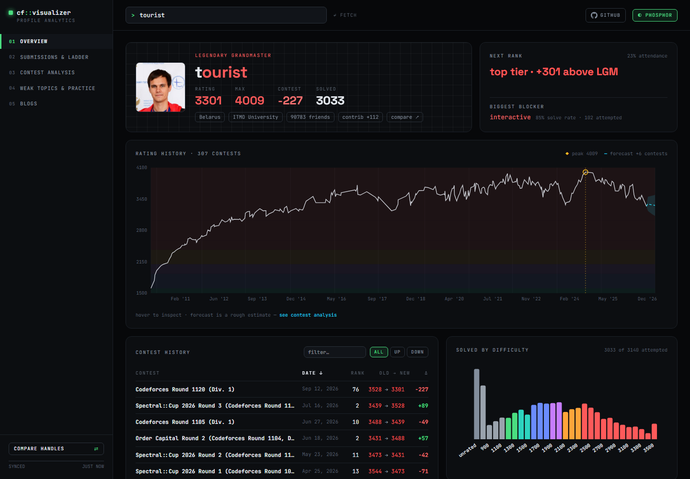
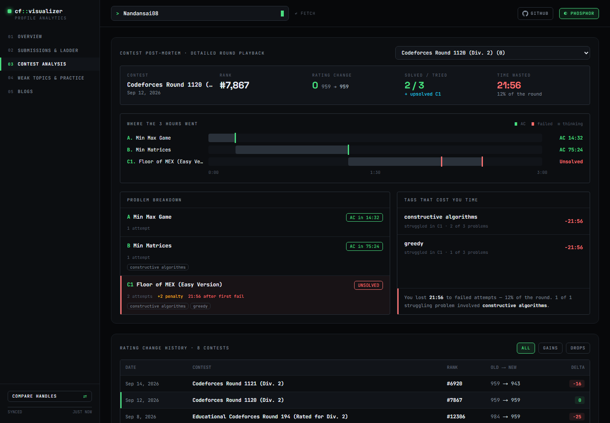
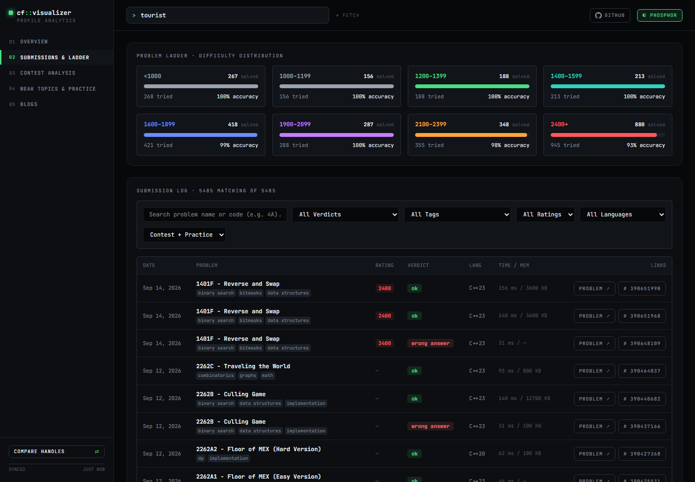
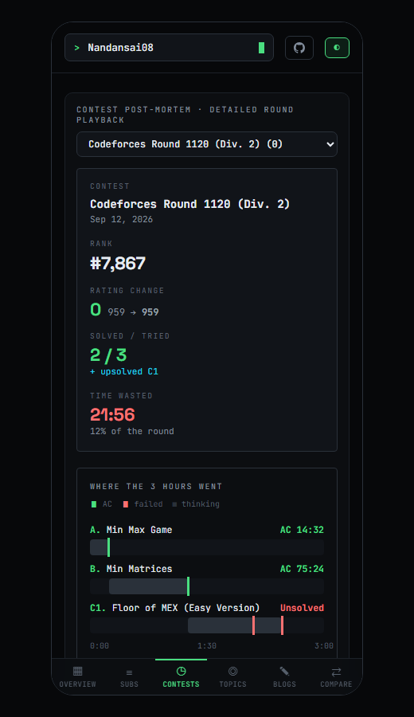
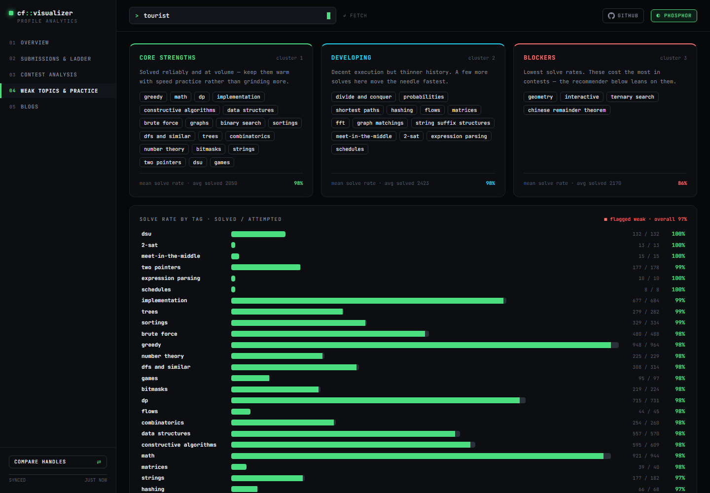

# cf::visualizer

Open-source Codeforces profile analytics for any handle: rating history with forecast, problem ladder,
full submission log, contest post-mortems (where the time went, tags that cost you time), weak-topic
clusters with practice recommendations, a live rating-change estimator, blogs, and head-to-head compare.

FastAPI backend (Codeforces proxy + cache + analytics) · React/Vite frontend · optional Chrome extension.
Works on desktop and mobile.

## Screenshots

**Overview** — rating curve over rank bands, forecast, contest history, solved by difficulty


**Contest post-mortem** — where the round's time went, penalties, and the tags that cost you time


<table>
  <tr>
    <td width="68%"><b>Submissions & problem ladder</b><br></td>
    <td><b>Mobile</b><br></td>
  </tr>
</table>

**Weak topics & practice** — strength clusters, smoothed solve rate per tag, recommendations


## Run locally

```bash
pip install -r backend/requirements.txt
cd backend && python -m uvicorn main:app --port 8000 --reload
```

```bash
cd frontend && npm install && npm run dev
```

Open http://localhost:5173 (Vite proxies `/api` to :8000).

Backend self-check (offline): `cd backend && python test_analytics.py`

## Deploy (Vercel)

The repo deploys as one Vercel project using [Services](https://vercel.com/docs/services), configured in
[`vercel.json`](vercel.json): `frontend/` builds with Vite, `backend/` runs as a Python function, and
`/api/*` is routed to the backend. Import the repository in Vercel and deploy; no environment variables are required.

On Vercel the SQLite cache lives in `/tmp` (per instance), so a cold instance re-fetches from Codeforces.
Set `CACHE_DIR` to change the cache location anywhere else.

## Chrome extension

1. `chrome://extensions` → enable Developer mode → **Load unpacked** → pick `extension/`.
2. Click the toolbar icon → Settings → enter your handle (backend/dashboard URLs default to localhost).

Badges appear on `codeforces.com/problemset/problem/*` and `codeforces.com/contest/*/problem/*`;
profile pages get an **Open in Visualizer** button. Summaries are cached in `chrome.storage` for 30 min.

## API

| Endpoint | What |
| --- | --- |
| `GET /api/profile/{handle}?tz=<minutes>&full=0/1` | info, rating history, solved/tag/verdict stats, weak topics, clusters, heatmap, forecast, phases, patterns, milestones, submissions |
| `GET /api/day/{handle}?date=YYYY-MM-DD&tz=` | submissions on one local day |
| `GET /api/recommend/{handle}` | unsolved problems near your rating, weighted to weak tags |
| `GET /api/estimate/{handle}?contestId=&rank=` | CF rating formula over the contest's real field (final rating changes, or live standings + rated list) |
| `GET /api/blogs/{handle}` | blog entries, newest first |
| `GET /api/summary/{handle}` | compact payload for the extension |
| `GET /api/contests` | recent/running contests |

## Notes

- All Codeforces calls go through one SQLite cache and a global lock spacing requests 2.1 s apart (CF's per-IP limit). Cold load of a large profile is ~10 s; cached loads are instant.
- Estimator matches real deltas within ~10 points on tested rounds. Other newcomers in the field are treated as internal 1400.
- Forecast is a damped, recency-weighted linear trend: a rough estimate, labelled as such.
- Attendance rate is approximate (name heuristic for rated rounds; parallel Div. 1/2 rounds counted once).
- Unofficial; not affiliated with Codeforces. Data comes from the public [Codeforces API](https://codeforces.com/apiHelp).

## Contributing

Issues and pull requests are welcome. Keep changes small, run `python backend/test_analytics.py`
and `npm run build` in `frontend/` before opening a PR.

## License

[MIT](LICENSE)
